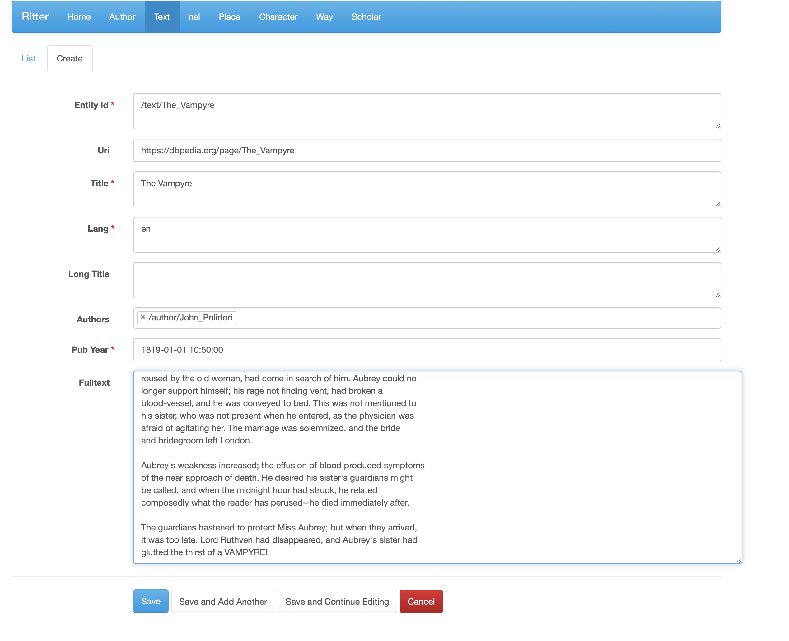

# Romantic Cartographies

[_Romantic Cartographies: Lived and Imagined Space in English and German Romantic Texts, 1790–1840_](https://askonivala.github.io/project/cartography/) (ROMCAR) is a digital humanities project that studies the construction of space during the [the Romantic era](https://en.wikipedia.org/wiki/Romanticism) (the 1790s--1840s).

The geoparsing methods developed during the project will enable extracting locational data from textual corpora. ROMCAR applies _named-entity linking_ (NEL) to extract toponyms from Romantic fiction and travelogues published in English and German. In addition to _named-entity recognition_ (NER), NEL disambiguates the found entities by linking them with [DBpedia](https://www.dbpedia.org). The results of text mining are visualised as superimposed maps, which produce new knowledge about the relationship of centre and periphery, or urban and natural areas in Romanticism.

The PI of ROMCAR is Docent [Asko Nivala](https://askonivala.github.io). ROMCAR has been funded by [Turku Institute for Advanced Studies (2017-2019)](https://www.utu.fi/en/research/research-collegia/tias) and [Academy of Finland](https://akareport.aka.fi/ibi_apps/WFServlet?IBIF_ex=x_HakKuvaus2&CLICKED_ON=&HAKNRO1=321945&UILANG=en&TULOSTE=HTML) (2019-2022).

## Ritter
Ritter is a software package for the spatial analysis of historical texts developed during the ROMCAR project. At the moment, you can add texts to the corpus with the admin interface and Ritter will run NEL analysis for them in the background. Moreover, Ritter makes it possible to annotate travel routes, rhetorical comparisons and other spatial relations between locations, which are shown as a network. More features will be added in the future.

### Installation

Ritter is based on [DBpedia Spotlight](https://github.com/dbpedia-spotlight/dbpedia-spotlight-model) (the NEL library), [MongoDB](https://www.mongodb.com) (the database), [Flask](https://flask.palletsprojects.com/en/2.0.x/) (the web framework) and [Leaflet.js](https://leafletjs.com) (interactive map).

After cloning the repository, you have to install and configure MongoDB. The default configuration of ROMCAR uses the public DBpedia Spotlight API for NEL functions. Please note that at the moment the default configuration of Ritter is not suitable for production use because there is no authentification. You can run a local instance of the development server with the script `run_development_server.sh`. For the production use, you have to add authentification and run Ritter as WSGI app with Apache and mod_wsgi or nginx and Gunicorn.

### Requirements
- MongoDB
- Flask
- flask-mongoengine
- leaflet.js
- DataTables
- GeoJSON
- Markdown
- Pandas
- sparql
